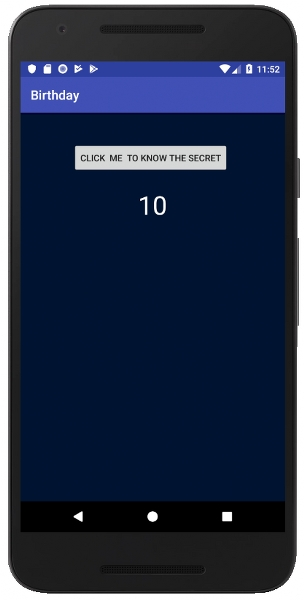
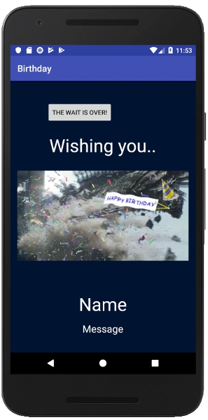

# Template for Birthday Android App
 

## To Run App
1. Download ```APP-APK.apk``` [Download Link](https://raw.githubusercontent.com/ft-abhishekgupta/android-simple-birthday-app/master/APP-APK.apk "Direct Download")
1. Install on Android Device and run.

## To use source code : 
1. Clone Repository <br>
```git clone https://github.com/ft-abhishekgupta/android-simple-birthday-app```
1. Open Repository in Android Studio
1. Sync Project and Install Required Dependencies
1. Build and Run Project.

## Modify App for your own website 
1. Modify values in ```strings.xml``` file with name and message
1. Generate Icons with the person's photo at https://romannurik.github.io/AndroidAssetStudio/icons-launcher.html and paste them in **res** folder
1. You can also replace the video and audio in **res/raw** folder.
1. Build and run. ```Your App is Ready```

## Screenshots

